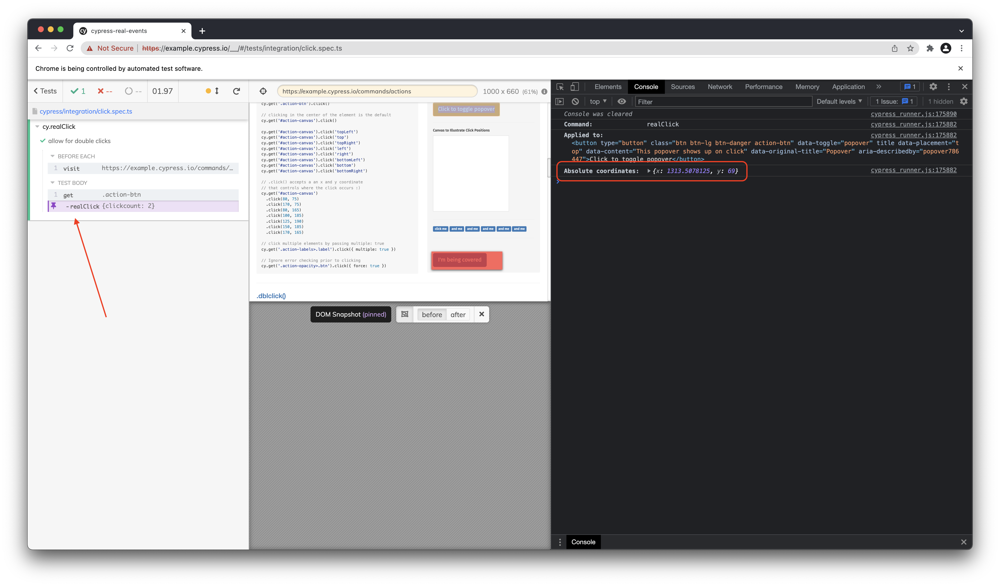

<p align="center">
  
</p>
<h1 align="center"> Cypress Real Events </h1>
<h3 align="center"> Fire native system events from Cypress </h3>

<p align="center">
 <a href="https://www.npmjs.com/package/cypress-real-events">
   
 <a/>
 <a href="https://www.npmjs.com/package/cypress-real-events">
   
 <a/>
 <a href="https://app.circleci.com/pipelines/github/dmtrKovalenko/cypress-real-events">
   
 <a/>
 
 <a href="https://twitter.com/goose_plus_plus">
   
 <a/>
<p />


[](https://vshymanskyy.github.io/StandWithUkraine/)

## Why?

Cypress default events are simulated. That means that all events like `cy.click` or `cy.type` are fired from javascript. That's why these events will be untrusted (`event.isTrusted` will be `false`) and they can behave a little different from real native events. But for some cases, it can be impossible to use simulated events, for example, to fill a native alert or copy to the clipboard. This plugin solves this problem.

## How?

Thanks to [Chrome Devtools Protocol](https://chromedevtools.github.io/devtools-protocol/). Cypress is connecting to CDP for tasks like screenshots, setting viewport, and others. This project utilizes the same connection to fire system events. The event firing system works literally like in puppeteer. And as a result, unlocks such features like **hovering** and **native focus management via Tab**.

## Requirements

Cypress only. Really. Cypress itself can fire native events. The only limitation for real events – **they work only in the chromium-based browser**. That means that Firefox is not supported, at least for now.

## Quick overview

Here is a simple test that can be written with native events:

```js
it("tests real events", () => {
  cy.get("input").realClick(); // perform a native real click on the field
  cy.realType("cypress real event"); // fires native system keypress events and fills the field
  cy.realPress("Tab"); // native tab click switches the focus
  cy.get("input").realMouseDown(); // perform a native mouse press on the field
  cy.get("input").realMouseUp(); // perform a native mouse release on the field
  cy.focused().realHover(); // hovers over the new focused element
  cy.contains("some text in the hovered popover");
});
```

## Installation

Install npm package:

```
npm install cypress-real-events

yarn add cypress-real-events
```

Register new commands by adding this to your `cypress/support/index.{js,ts}` file.

```js
import "cypress-real-events";
```
To include TypeScript declarations, add `"cypress-real-events"` to the `types` section of your [tsconfig.json](https://docs.cypress.io/guides/tooling/typescript-support) file:
```json
{
  "compilerOptions": {
    "types": ["cypress", "node", "cypress-real-events"]
  }
}
```

## API

The idea of the commands – they should be as similar as possible to cypress default commands (like `cy.type`), but starts with `real` – `cy.realType`.

Here is an overview of the available **real** event commands:

- [cy.realClick](#cyrealclick)
- [cy.realHover](#cyrealhover)
- [cy.realPress](#cyrealpress)
- [cy.realTouch](#cyrealtouch)
- [cy.realType](#cyrealtype)
- [cy.realSwipe](#cyrealswipe)
- [cy.realMouseDown](#cyrealmousedown)
- [cy.realMouseUp](#cyrealmouseup)
- [cy.realMouseMove](#cyrealmousemove)
- [cy.realMouseWheel](#cyrealmousewheel)

## cy.realClick

Fires native system click event.

```jsx
cy.get("button").realClick();
cy.get("button").realClick(options);
```

Example:

```js
cy.get("button").realClick({ position: "topLeft" }); // click on the top left corner of button
cy.get("body").realClick({ x: 100, y: 1240 }); // click by the x & y coordinates relative to the whole window
```

Options:

- `Optional` **button**: \"none\" \| \"left\" \| \"right\" \| \"middle\" \| \"back\" \| \"forward\"
- `Optional` **pointer**: \"mouse\" \| \"pen\"
- `Optional` **x**: undefined \| number ([more about coordinates](#coordinates))
- `Optional` **y**: undefined \| number ([more about coordinates](#coordinates))
- `Optional` **position**: "topLeft" | "top" | "topRight" | "left" | "center" | "right" | "bottomLeft" | "bottom" | "bottomRight"
- `Optional` **scrollBehavior**: "center" | "top" | "bottom" | "nearest" | false
- `Optional` **clickCount**: number

> Make sure that `x` and `y` have a bigger priority than `position`.

## cy.realHover

Fires a real native hover event. Yes, it can test `:hover` preprocessor.

```jsx
cy.get("button").realHover();
cy.get("button").realHover(options);
```

Example:

```js
cy.get("button").realHover({ position: "bottomLeft" }); // hovers over the bottom left corner of button
```

Options:

- `Optional` **pointer**: \"mouse\" \| \"pen\"
- `Optional` **position**: "topLeft" | "top" | "topRight" | "left" | "center" | "right" | "bottomLeft" | "bottom" | "bottomRight"
- `Optional` **scrollBehavior**: "center" | "top" | "bottom" | "nearest" | false

## cy.realPress

Fires native press event. It can fire one key event or the "shortcut" like Shift+Control+M.
Make sure that event is global, it means that it is required to **firstly** focus any control before firing this event.

```jsx
cy.realPress("Tab"); // switch the focus for a11y testing
cy.realPress(["Alt", "Meta", "P"]); // Alt+(Command or Control)+P
```

### Usage

```js
cy.realPress(key);
cy.realPress(key, options);
```

### Parameters:

| Name      | Type                 | Default value | Description                                                                                                                                                                                                                                                      |
| --------- | -------------------- | ------------- | ---------------------------------------------------------------------------------------------------------------------------------------------------------------------------------------------------------------------------------------------------------------- |
| `key`     | `string \| string[]` | -             | key or keys to press. Should be the same as cypress's [type command argument](https://docs.cypress.io/api/commands/type.html#Arguments). All the keys available [here](https://github.com/dmtrKovalenko/cypress-real-events/blob/main/src/keyCodeDefinitions.ts) |
| `options` | Options              | {}            |                                                                                                                                                                                                                                                                  |

Options:

- `Optional` **pointer**: \"mouse\" \| \"pen\"

### cy.realTouch

Fires native system touch event.

```jsx
cy.get("button").realTouch();
cy.get("button").realTouch(options);
```

##### Usage:

```js
cy.get("button").realTouch({ position: "topLeft" }); // touches the top left corner of button
cy.get("body").realTouch({ x: 100, y: 1240 }); // touches the x & y coordinates relative to the whole window
```

Options:

- `Optional` **x**: undefined \| number ([more about coordinates](#coordinates))
- `Optional` **y**: undefined \| number ([more about coordinates](#coordinates))
- `Optional` **position**: "topLeft" | "top" | "topRight" | "left" | "center" | "right" | "bottomLeft" | "bottom" | "bottomRight"
- `Optional` **radius**: undefined \| number **`default`** 1
- `Optional` **radiusX**: undefined \| number **`default`** 1
- `Optional` **radiusY**: undefined \| number **`default`** 1

### cy.realType

Runs a sequence of native press events (via `cy.realPress`). This can be used to simulate real typing.
Make sure that type of event is global. This means that it is not attached to any field.

```js
cy.realType("type any text"); // type any text on the page

cy.get("input").focus();
cy.realType("some text {enter}"); // type into focused field
```

#### Usage:

```js
cy.realType(text);
cy.realType(text, options);
```

#### Parameters:

| Name      | Type    | Default value | Description                                                                                                                           |
| --------- | ------- | ------------- | ------------------------------------------------------------------------------------------------------------------------------------- |
| `text`    | string  | -             | text to type. Should be around the same as cypress's type command argument (https://docs.cypress.io/api/commands/type.html#Arguments. All the keys available [here](https://github.com/dmtrKovalenko/cypress-real-events/blob/main/src/keyCodeDefinitions.ts)  |
| `options` | Options | {}            |                                                                                                                                       |

Options:

- `Optional` **delay**: undefined \| number **`default`** 30
- `Optional` **log**: undefined \| false \| true **`default`** true
- `Optional` **pressDelay**: undefined \| number **`default`** 10

### cy.realSwipe

Runs native swipe events. It means that **touch events** will be fired. Actually a sequence of `touchStart` -> `touchMove` -> `touchEnd`. It can perfectly swipe drawers and other tools [like this one](https://csb-dhe0i-qj8xxmx8y.vercel.app/).

> Make sure to enable mobile viewport :)

```js
cy.get(".element").realSwipe("toLeft"); // swipes from right to left
cy.get(".element").realSwipe("toRight"); // inverted
```

#### Usage:

```js
cy.realSwipe(direction);
cy.realSwipe(direction, options);
```

#### Parameters:

| Name        | Type                                              | Default value | Description        |
| ----------- | ------------------------------------------------- | ------------- | ------------------ |
| `direction` | `"toLeft" \| "toTop" \| "toRight" \| "toBottom";` | -             | Direction of swipe |
| `options`   | Options                                           | {}            |                    |

Options:

- `Optional` **length**: undefined \| number **`default`** 10
- `Optional` **step**: undefined \| number **`default`** 10
- `Optional` **x**: undefined \| number ([more about coordinates](#coordinates))
- `Optional` **y**: undefined \| number ([more about coordinates](#coordinates))
- `Optional` **touchPosition**: "topLeft" | "top" | "topRight" | "left" | "center" | "right" | "bottomLeft" | "bottom" | "bottomRight"
- `Optional` **touchMoveDelay**: undefined \| number **`default`** 0

## cy.realMouseDown

Fires native system mouse down event.

```jsx
cy.get("button").realMouseDown();
cy.get("button").realMouseDown(options);
```

Example:

```js
cy.get("button").realMouseDown({ position: "topLeft" }); // click on the top left corner of button
```

Options:

- `Optional` **pointer**: \"mouse\" \| \"pen\"
- `Optional` **position**: "topLeft" | "top" | "topRight" | "left" | "center" | "right" | "bottomLeft" | "bottom" | "bottomRight"
- `Optional` **scrollBehavior**: "center" | "top" | "bottom" | "nearest" | false
- `Optional` **button**: "left" | "middle" | "right" | "back" | "forward" | "none"

## cy.realMouseUp

Fires native system mouse up event.

```jsx
cy.get("button").realMouseUp();
cy.get("button").realMouseUp(options);
```

Example:

```js
cy.get("button").realMouseUp({ position: "topLeft" }); // click on the top left corner of button
```

Options:

- `Optional` **pointer**: \"mouse\" \| \"pen\"
- `Optional` **position**: "topLeft" | "top" | "topRight" | "left" | "center" | "right" | "bottomLeft" | "bottom" | "bottomRight"
- `Optional` **scrollBehavior**: "center" | "top" | "bottom" | "nearest" | false
- `Optional` **button**: "left" | "middle" | "right" | "back" | "forward" | "none"

## cy.realMouseMove

Fires native system mouseMoved event. Moves mouse inside a subject to the provided amount of coordinates from top left corner (adjustable with position option.)

```jsx
cy.get("sector").realMouseMove(x, y);
cy.get("sector").realMouseMove(x, y, options);
```

Example:

```js
cy.get("sector").realMouseMove(50, 50, { position: "center" }); // moves by 50px x and y from center of sector
```

Options:

- `Optional` **position**: "topLeft" | "top" | "topRight" | "left" | "center" | "right" | "bottomLeft" | "bottom" | "bottomRight"
- `Optional` **scrollBehavior**: "center" | "top" | "bottom" | "nearest" | false

## cy.realMouseWheel

Fires native system mouse wheel event, scrolls the page.

```jsx
cy.get("div").realMouseWheel(options);
```

Example:

```js
cy.get("div").realMouseWheel({ deltaY: 100 }) // Scroll down, mouse will be positioned at centered by default.
cy.get("div").realMouseWheel({ deltaY: -100 }) // Scroll up, mouse will be positioned at centered by default.
cy.get("div").realMouseWheel({ deltaX: 500 }) // Scroll right, mouse will be positioned at centered by default.
cy.get("div").realMouseWheel({ deltaX: -500 }) // Scroll left, mouse will be positioned at centered by default.
cy.get("div").realMouseWheel({ deltaY: 100, deltaX: 100 }) // Scroll right and down, mouse will be positioned at centered by default.
```

Options:

- `Optional` **scrollBehavior**: "center" | "top" | "bottom" | "nearest" | false
- `Optional` **deltaX**: X delta in CSS pixels for mouse wheel event (default: 0). Positive values emulate a scroll right and negative values emulate scroll left event.
- `Optional` **deltaY**: Y delta in CSS pixels for mouse wheel event (default: 0). Positive values emulate a scroll down and negative values emulate a scroll up event.

## Coordinates

Several commands from this plugin accept `{ x: number, y: number }` coordinates. There is an important note that these coordinates are relative to the whole tab to pass it right to the CDP. For regular elements, we calculate them automatically, but if you need to pass absolute coordinates you will need to provide them yourself.

The easiest way to debug coordinates is to run any real events command and check the logged coordinates by clicking on the command.



## FAQ

### 1. Why `cy.realHover` hovering state does not show in the visual regression services?

Unfortunately, neither visual regression services like Happo and Percy nor plain cy.screenshot do not allow to test the hovering state. The hovering state is very different from any kind of js and css so it is not possible to capture it using dom snapshotting (like visual regression services do) and the screenshooting as well because cypress core itself is preventing hovering state in the screenshots.

### 2. When I am doing `cy.realHover` hovering state is not resetting after my checks

Let's take an example. If the real user needs to open menu popover then do check content of popover content and close it the algorithm will be:

1. Hover menu
2. Check the content
3. Put mouse away from the popover

To automate this with cypress, you can do the following

```tsx
cy.get("[aria-label='Test Button']")
  .should("have.css", "background-color", "rgb(217, 83, 79)") // check the state before hover
  .realHover()
  .should("have.css", "background-color", "rgb(201, 48, 44"); // test hovering state

// reset hovering by putting mouse away (e.g. here top left corner of body)
cy.get("body").realHover({ position: "topLeft" });
// hover state reset 🎉
cy.get("[aria-label='Test Button']").should(
  "have.css",
  "background-color",
  "rgb(217, 83, 79)"
);
```

### 3. Why do I get "Are You Sure" popups when I am using real events and why I do not get them while using the normal cypress clicks?
Sometimes when there are unsaved changes in a webform, and you leave the page, the web application asks you due the `onbeforeunload event` if you really want to leaf the page and loose the changes.

You can try it on this [Demo Page](https://www.azyaamode.com/js/jquery/AYS/demo/are-you-sure-demo.html).

In "normal" Cypress tests, these popup windows do not appear. 
This is because no "real" user actions are performed on the application. 
See [this](https://developer.mozilla.org/en-US/docs/Web/API/Window/beforeunload_event#security) page for more information about the beforeunload event.
But when they appear, they block the whole test execution, and you have to handle them explicitly.
Gleb Bahmutov writes about this behaviour and possible solutions in this [Blog Post](https://glebbahmutov.com/blog/onbeforeunload/).

Now when you use this `real-events` plugin and perform a `realEvent` on your application, the browser thinks there happened a real user interaction.
From now on your test is in an `active interaction` state, which allows the application to use all the features listed [here](https://developer.mozilla.org/en-US/docs/Web/Security/User_activation).
## UX

One problem of the real native system events I need to mention – you will not get an error message if the event wasn't produced. Similar to selenium or playwright – if a javascript event was not fired you will not get a comprehensive error message.

So probably this package should not be used as a replacement for the cypress events, at least for the writing tests experience 🐨

## License

The project is licensed under the terms of [MIT license](./LICENSE)
